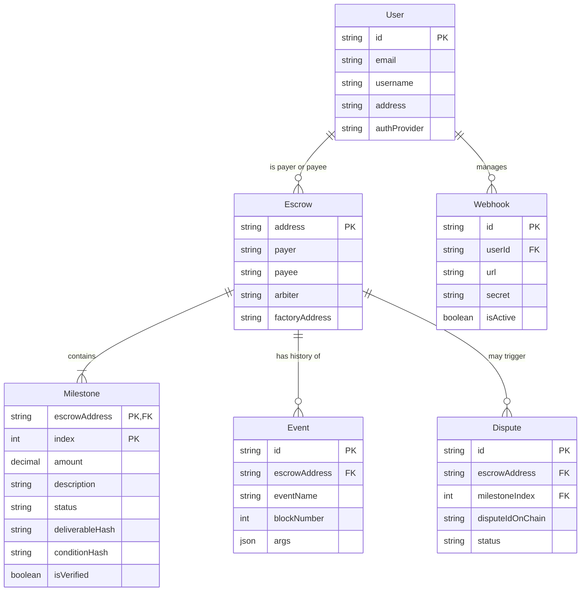

# API Documentation

Welcome to the EscrowKit API. This API allows you to interact with the EscrowKit protocol programmatically, enabling you to deploy escrows, manage webhooks, and retrieve contract data off-chain.

**Base URL**: `http://localhost:3001` (Local Development)

## 🔐 Authentication

Most endpoints require an API Key to identify the user and apply rate limits.
Include the key in the header of your requests.

**Header:**
`x-api-key: YOUR_API_KEY`

---

## 📦 Escrows

### List Escrows
Retrieve a list of escrows where the API Key owner is either the payer or the payee.

- **Endpoint**: `GET /api/v1/escrows`
- **Auth**: Required
- **Response**:
  ```json
  [
    {
      "address": "0x123...",
      "payer": "0xABC...",
      "payee": "0xDEF...",
      "arbiter": "0x000...",
      "milestones": [...]
    }
  ]
  ```

### Get Escrow Details
Retrieve detailed information about a specific escrow, including milestones, disputes, and recent events.

- **Endpoint**: `GET /api/v1/escrows/:address`
- **Auth**: Required
- **Path Parameters**:
    - `address`: The Ethereum address of the escrow contract.
- **Response**:
  ```json
  {
    "address": "0x123...",
    "milestones": [...],
    "disputes": [...],
    "events": [...]
  }
  ```

---

## 🛠 Transaction Helper

Helper endpoints to generate encoded calldata for interacting with smart contracts. This is useful if you are building a backend that needs to construct transactions for a frontend or signer.

### Deploy Escrow
Generate calldata to deploy a new escrow via the Factory.

- **Endpoint**: `POST /api/v1/transactions/deploy`
- **Auth**: Required
- **Body**:
  ```json
  {
    "payee": "0x...",
    "arbiter": "0x...",
    "amounts": ["1.5", "0.5"], // ETH amounts as strings
    "descriptions": ["Milestone 1", "Milestone 2"]
  }
  ```
- **Response**:
  ```json
  {
    "to": "0xFactoryAddress...",
    "data": "0x...", // Encoded calldata
    "value": "0"
  }
  ```

### Release Milestone
Generate calldata to release a specific milestone.

- **Endpoint**: `POST /api/v1/transactions/release`
- **Auth**: Required
- **Body**:
  ```json
  {
    "escrowAddress": "0x...",
    "milestoneId": 0
  }
  ```
- **Response**:
  ```json
  {
    "to": "0xEscrowAddress...",
    "data": "0x..."
  }
  ```

---

## 🪝 Webhooks

Register URLs to receive real-time notifications about escrow events (Created, Funded, Released, Disputed).

### Register Webhook
- **Endpoint**: `POST /api/v1/webhooks`
- **Auth**: Required
- **Body**:
  ```json
  {
    "url": "https://your-backend.com/webhook",
    "events": ["EscrowCreated", "MilestoneReleased"],
    "secret": "optional-signing-secret"
  }
  ```
- **Response**:
  ```json
  {
    "id": "webhook-id",
    "url": "...",
    "secret": "...", // Save this to verify signatures
    "isActive": true
  }
  ```

### List Webhooks
- **Endpoint**: `GET /api/v1/webhooks`
- **Auth**: Required
- **Response**: Array of registered webhook objects.

---

## 📂 Evidence Storage

Decentralized-ready storage for dispute evidence.

### Upload Evidence
Upload a file (PDF, Image, etc.) related to a dispute or milestone deliverable.

- **Endpoint**: `POST /evidence/upload`
- **Auth**: Public (for now)
- **Headers**: `Content-Type: multipart/form-data`
- **Body**: Form data with field `file`.
- **Response**:
  ```json
  {
    "success": true,
    "hash": "Qm...", // IPFS-compatible hash
    "url": "http://.../evidence/Qm...",
    "filename": "proof.pdf"
  }
  ```

### Download Evidence
- **Endpoint**: `GET /evidence/:hash`
- **Response**: Returns the file stream.

---

## 📝 Milestone Drafts

Collaborative drafting of milestones before deployment.

### Create Draft
- **Endpoint**: `POST /api/v1/drafts`
- **Body**:
  ```json
  {
    "escrowAddress": "0x... (optional if new)",
    "title": "Design Phase",
    "description": "...",
    "amount": "1.0",
    "deadline": "2024-12-31T23:59:59Z",
    "creator": "0xUser..."
  }
  ```

### Get Drafts
- **Endpoint**: `GET /api/v1/drafts/:escrowAddress`

---

## ⚖️ Disputes

### Get Evidence Calldata
Generate the `submitEvidence` calldata for the Arbitration Adapter.

- **Endpoint**: `POST /api/v1/disputes/evidence`
- **Body**:
  ```json
  {
    "adapterAddress": "0x...",
    "disputeId": 1,
    "evidence": "QmHash..."
  }
  ```

### Receive Ruling (Webhook)
Endpoint used by the Arbitration Service to push rulings.

- **Endpoint**: `POST /api/v1/disputes/webhook/ruling`

## 🗄️ Database Relationships & Entity Model

The API is driven by a relational PostgreSQL database synced via our Indexer. The following Entity-Relationship (ER) diagram details the core models and their connections.


