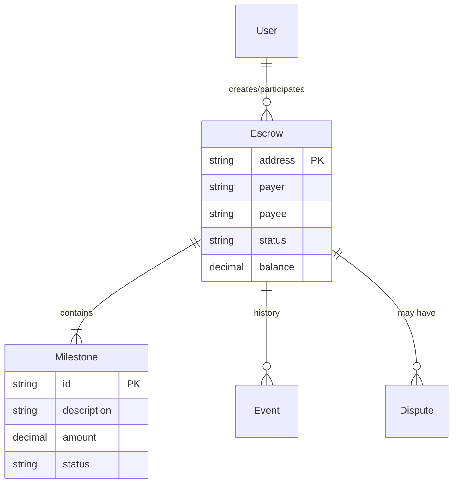

# EscrowKit Architecture

## 1. System Overview
EscrowKit is a **Trustless Marketplace Engine** designed to provide secure, milestone-based payments for platforms. It operates as a "Boxed Solution" that platforms can integrate to handle payments without taking custody of funds.

### Core Philosophy
- **Non-Custodial**: Funds are held in smart contracts, not by the platform or EscrowKit.
- **Trustless**: Operations are governed by code; disputes are resolved by decentralized or pre-agreed arbiters.
- **Milestone-Based**: Payments are released only when specific deliverables are met and approved.

---

## 2. Technical Architecture

The system consists of four primary components:

### A. Smart Contracts (`packages/contracts`)
*   **Techn**: Solidity, Foundry
*   **Role**: The "Trust Layer". Holds funds and business logic.
*   **Key Contracts**:
    *   `EscrowFactory`: Registry and factory for creating new escrow clones.
    *   `MilestoneEscrow`: The main escrow instance. Handles:
        *   Deposits (payer -> contract)
        *   Milestone allocation
        *   Releases (contract -> payee)
        *   Refunds (contract -> payer)
        *   Dispute initiation
    *   `IArbitrationAdapter`: Interface for connecting to arbitration services (e.g., Kleros, reality.eth).

### B. Indexer Service (`packages/indexer`)
*   **Tech**: TypeScript, Viem, Prisma, PostgreSQL
*   **Role**: The "Data Layer". Listens to blockchain events and syncs state to a queryable database.
*   **Workflow**:
    1.  Poller fetches logs from RPC (Anvil/Ethereum).
    2.  Parses events: `EscrowCreated`, `Funded`, `MilestoneCompleted`, `DisputeOpened`.
    3.  Updates relational data in Postgres via Prisma.
    4.  Ensures data consistency for the API.

### C. Read API (`packages/api`)
*   **Tech**: NestJS, Swagger
*   **Role**: The "Integration Layer". Provides fast, structured access to escrow data for the dApp and third-party platforms.
*   **Key Features**:
    *   **Public API**: Secured via API Keys (`/api/v1/...`).
    *   **Internal API**: Powers the Dashboard.
    *   **Evidence Handling**: Manages metadata for disputes (IPFS/Storage).

### D. dApp Dashboard (`packages/dapp`)
*   **Tech**: Next.js (App Router), Wagmi, Tailwind CSS, Shadcn UI
*   **Role**: The "User Interface".
    *   **Dashboard**: For platforms/users to view all their transactions.
    *   **Escrow Page**: A shared link for Payer and Payee to interact (Fund, Submit, Approve).
    *   **Admin Tools**: API Key management and developer settings.

---

## 3. Data Flow

### Scenario: Creating and Completing an Escrow

1.  **Instantiation**: 
    *   User fills "Create Escrow" form in dApp.
    *   dApp calls `EscrowFactory.createEscrow()` on-chain.
2.  **Indexing**:
    *   Contracts emit `EscrowCreated`.
    *   Indexer picks up event -> writes `Escrow` entry to DB.
3.  **Discovery**:
    *   API serves the new escrow at `/api/v1/escrows/:address`.
    *   dApp redirects user to `/escrow/:address`.
4.  **Funding**:
    *   Payer connects wallet -> calls `deposit()` on contract.
    *   Indexer updates DB status to `FUNDED`.
5.  **Completion**:
    *   Payee marks milestone complete.
    *   Payer approves release.
    *   Contract sends funds to Payee.

---

## 4. Database Schema (Simplified)

## 5. Security & Invariants
*   **Solvency**: The contract balance strictly tracks `Deposited - Released - Refunded`.
*   **Immutability**: Core terms (Arbitrator, Fee) are fixed upon creation.
*   **Access Control**: Only the Payer can release funds; only the Arbiter can resolve disputes.
