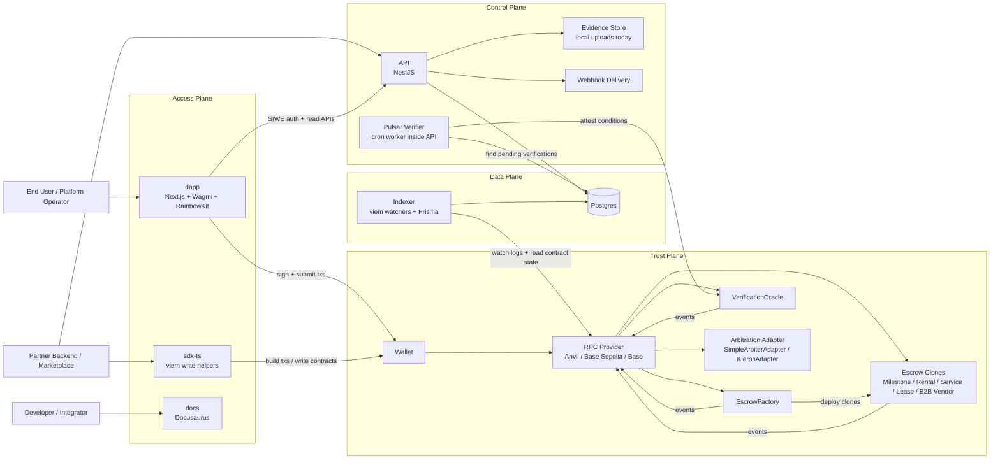
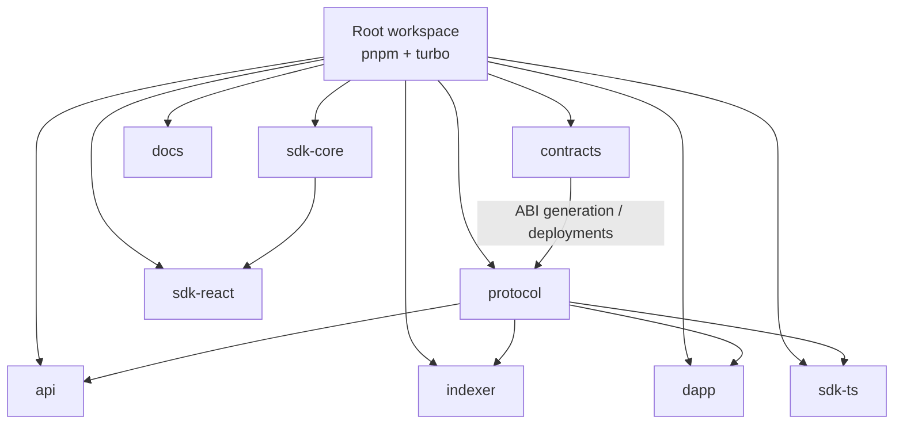
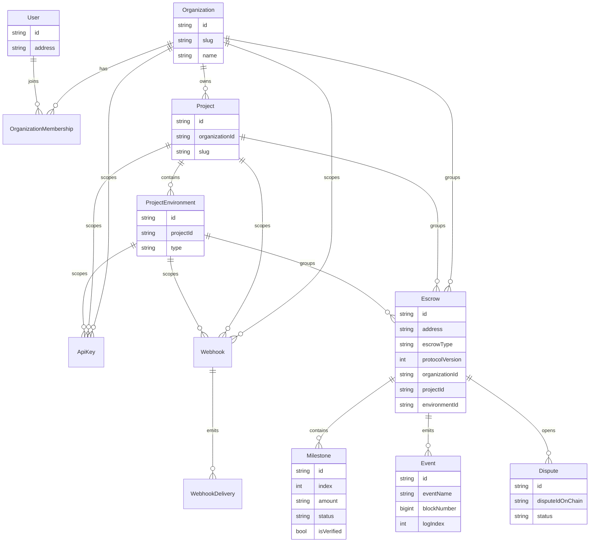
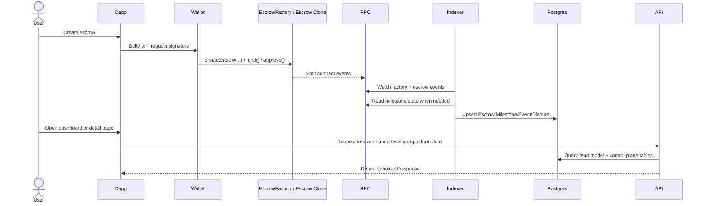

# EscrowKit Architecture

## 1. Executive Summary

EscrowKit is a PNPM + Turbo monorepo for a non-custodial escrow platform. The architecture is best understood as five cooperating planes:

- **Trust plane**: Solidity contracts hold funds and enforce escrow rules.
- **Protocol plane**: a shared TypeScript package publishes ABIs, deployments, enums, and contract metadata.
- **Access plane**: the Next.js dapp and SDKs let wallets and partner apps create, fund, and operate escrows.
- **Data plane**: a viem-based indexer converts on-chain events into a Postgres read model.
- **Control plane**: a NestJS API adds auth, user profiles, multi-tenant developer tooling, API keys, webhooks, evidence, and dashboard reads.

The core design principle is:

- **On-chain contracts are the source of truth for custody and state transitions.**
- **Postgres is the source of truth for fast reads, filtering, dashboards, and partner integrations.**
- **The protocol package is the source of truth for every off-chain package that needs chain metadata.**

## 2. Monorepo Package Map

| Package | Role | Notes |
| --- | --- | --- |
| `packages/contracts` | Trust layer | Solidity contracts, clone factory, arbitration adapters, verification oracle, Foundry tests, deploy script |
| `packages/protocol` | Shared protocol metadata | Generated ABIs, deployment resolution helpers, protocol enums used by dapp/API/indexer/SDK |
| `packages/indexer` | Chain-to-DB projection worker | Watches factory and escrow events with viem and writes a Prisma/Postgres read model |
| `packages/api` | Control plane and read API | NestJS app with SIWE auth, wallet-scoped endpoints, developer platform, webhooks, evidence, transaction helpers |
| `packages/dapp` | End-user and operator UI | Next.js App Router app using Wagmi, RainbowKit, React Query, and protocol ABIs |
| `packages/sdk-ts` | Write-side integration SDK | Contract write helpers and recipes for partner apps |
| `packages/sdk-core` | Shared control-plane types | Multi-tenant API types shared in package form |
| `packages/sdk-react` | React integration layer | Currently minimal; positioned for hooks/components on top of `sdk-core` |
| `packages/docs` | Documentation site | Docusaurus docs site for product and developer documentation |

## 3. Runtime Topology



## 4. Build and Package Dependency Graph



## 5. Subsystem Responsibilities

### 5.1 Contracts (`packages/contracts`)

This is the trust anchor.

- `EscrowFactory` clones escrow implementations and emits creation events.
- Supported escrow kinds today:
  - `MilestoneEscrow`
  - `RentalEscrow`
  - `ServiceEscrow`
  - `LeaseEscrow`
  - `B2BVendorEscrow`
- `VerificationOracle` stores trusted attestations for condition hashes.
- `SimpleArbiterAdapter` and `KlerosAdapter` provide dispute resolution integration points.
- The factory can be paused globally, and child contracts check factory pause state before acting.

Important invariant:

- The contract layer owns fund custody, release/refund/dispute transitions, and the canonical event stream.

### 5.2 Protocol Package (`packages/protocol`)

This package is the off-chain protocol contract.

- Publishes generated ABIs and deployment constants.
- Exposes `EscrowKind`, `ProtocolVersion`, and `resolveDeployments(...)`.
- Decouples off-chain packages from raw artifact paths.
- Lets the dapp, API, indexer, and SDK all agree on addresses and interfaces.

### 5.3 Indexer (`packages/indexer`)

The indexer is the chain projection service.

- Connects to an RPC endpoint with viem.
- Watches:
  - primary v2 factory
  - optional legacy v1 factories
  - verification oracle
  - milestone escrow clone events
- Persists chain-derived entities into Postgres:
  - `Escrow`
  - `Milestone`
  - `Event`
  - `Dispute`
- Seeds milestones by reading escrow contract state after creation or update events.
- Persists deterministic event ordering with `blockNumber + logIndex`.

Current implementation note:

- Full per-escrow event watching is implemented for milestone escrows.
- Other escrow kinds are recognized at factory creation time, but their full event projection is not yet implemented in the same depth.

### 5.4 API (`packages/api`)

The API is the control plane plus read facade.

Main responsibilities:

- **SIWE auth**
  - nonce issuance
  - SIWE verification
  - signed session token validation
- **Wallet-scoped user APIs**
  - profile
  - stats
  - escrow history
  - personal API keys
- **Developer platform**
  - organizations
  - memberships
  - projects
  - sandbox / production environments
  - scoped API keys
  - webhook registration and replay
  - audit logging
- **Public API**
  - API-key-protected reads for escrow data
  - transaction helper endpoints that return calldata for create/release operations
- **Evidence**
  - file upload and retrieval
- **Verification support**
  - a scheduled "Pulsar" service scans pending milestones and writes attestations to the oracle

Security model:

- User endpoints use `JwtAuthGuard` + `WalletOwnerGuard`.
- Public integration endpoints use `ApiKeyGuard`.
- API keys are stored hashed and only revealed once.

### 5.5 Dapp (`packages/dapp`)

The dapp is both the product UI and operator console.

It currently does two different kinds of work:

- **Direct chain interaction**
  - wallet connection with Wagmi / RainbowKit
  - direct contract reads and writes
  - escrow type detection from contract bytecode / ABI probing
- **Off-chain reads and control-plane actions**
  - SIWE sign-in against the API
  - dashboard reads from the indexed Postgres read model
  - developer platform console for org/project/environment/api-key/webhook management

Functional UI areas:

- escrow creation flows
- escrow detail pages
- wallet-scoped dashboard/history
- developer platform console
- profile/settings

### 5.6 SDKs

The SDK story is split:

- `sdk-ts`
  - real write-side helper for partner integrations
  - wraps viem contract writes and exposes recipe helpers
- `sdk-core`
  - shared TypeScript types for the control-plane API
- `sdk-react`
  - currently a thin placeholder, positioned for future hooks/components

### 5.7 Docs (`packages/docs`)

- Docusaurus documentation site
- Serves onboarding, contract overviews, SDK docs, and public documentation

## 6. Data Ownership and Storage Model

EscrowKit uses one primary off-chain database today, but two different classes of data live in it.

### 6.1 Chain-Derived Read Model

Owned by the indexer.

- `Escrow`
- `Milestone`
- `Event`
- `Dispute`

Rules:

- Derived from events and contract reads
- Should be treated as a projection of chain state
- Should not be manually mutated by normal business workflows

### 6.2 Control-Plane and Product Data

Owned by the API.

- `User`
- `Organization`
- `OrganizationMembership`
- `Project`
- `ProjectEnvironment`
- `ApiKey`
- `Webhook`
- `WebhookDelivery`
- `AuditLog`
- `MilestoneDraft`

Rules:

- Created and mutated by authenticated API workflows
- Used for tenancy, access control, operational tooling, and UX-only collaboration features

### 6.3 Evidence Storage

Current state:

- Evidence files are stored on local disk under `uploads/`.
- Hashes are used as file identifiers, acting as a mock IPFS model.

Recommended target:

- Move evidence to object storage or content-addressed storage.
- Persist only metadata and content hashes in Postgres.

## 7. Domain Model Diagram



## 8. Main Operational Flow



## 9. Verification and Dispute Flow

```mermaid
flowchart TD
    Payee["Payee submits deliverable"] --> Escrow["MilestoneEscrow.submitDeliverable"]
    Escrow --> Event1["MilestoneSubmitted / VerificationRequested"]
    Event1 --> Indexer["Indexer updates milestone status"]
    Indexer --> PG[("Postgres")]

    PG --> Pulsar["Pulsar cron scans submitted milestones\nwith condition hashes"]
    Pulsar --> Oracle["VerificationOracle.attest(conditionHash, true/false)"]
    Oracle --> Event2["VerificationAttested"]
    Event2 --> Indexer
    Indexer --> PG

    PG --> Dapp["Dapp reads verification state through API or direct chain reads"]

    Escrow -->|openDispute| Adapter["Arbitration Adapter"]
    Adapter -->|rule(...)| Escrow
    Escrow --> Event3["DisputeOpened / resolution events"]
    Event3 --> Indexer
    Indexer --> PG
```

## 10. Recommended Production Topology

The repo already supports local development, but the clean production operating model should be:

- **Static/frontdoor**
  - deploy `dapp` and `docs` behind a CDN
- **Stateless services**
  - run `api` as horizontally scalable stateless instances
- **Workers**
  - run `indexer` as a singleton or sharded worker
  - run verification and webhook delivery as separate workers if volume grows
- **Stateful backing services**
  - managed Postgres
  - managed object storage for evidence
  - managed RPC provider

Recommended evolution from the current codebase:

- move webhook delivery onto an outbox + worker pattern
- move evidence off local disk
- either wire Redis into queues/rate limits/caching or remove it from dev topology until needed
- share `sdk-core` types directly with the dapp to avoid duplicated control-plane types
- add first-class event projection for non-milestone escrow variants in the indexer

## 11. Current-State Gaps Worth Calling Out

These are important so the architecture is honest about the repo as it stands:

- `docker-compose.yml` provisions Redis, but no active service currently uses it.
- webhook registration, delivery persistence, and replay are implemented in the API, but domain event triggering is not yet fully wired from the live business flows.
- evidence storage is local filesystem-based rather than object storage or IPFS.
- `sdk-react` is still a scaffold rather than a mature integration layer.
- the indexer is strongest on milestone escrow projection; other escrow kinds are partially represented.

## 12. Architectural Bottom Line

EscrowKit already has the right high-level shape for a serious escrow platform:

- **contracts own truth and custody**
- **the protocol package keeps every off-chain service aligned**
- **the indexer turns blockchain activity into product-grade queryability**
- **the API adds auth, tenancy, and partner integrations**
- **the dapp and SDKs stay thin on writes and rich on reads**

That makes this a strong architecture for a marketplace-grade escrow platform, with the main next step being to harden the off-chain operational pieces around webhook delivery, evidence storage, and non-milestone indexing coverage.
