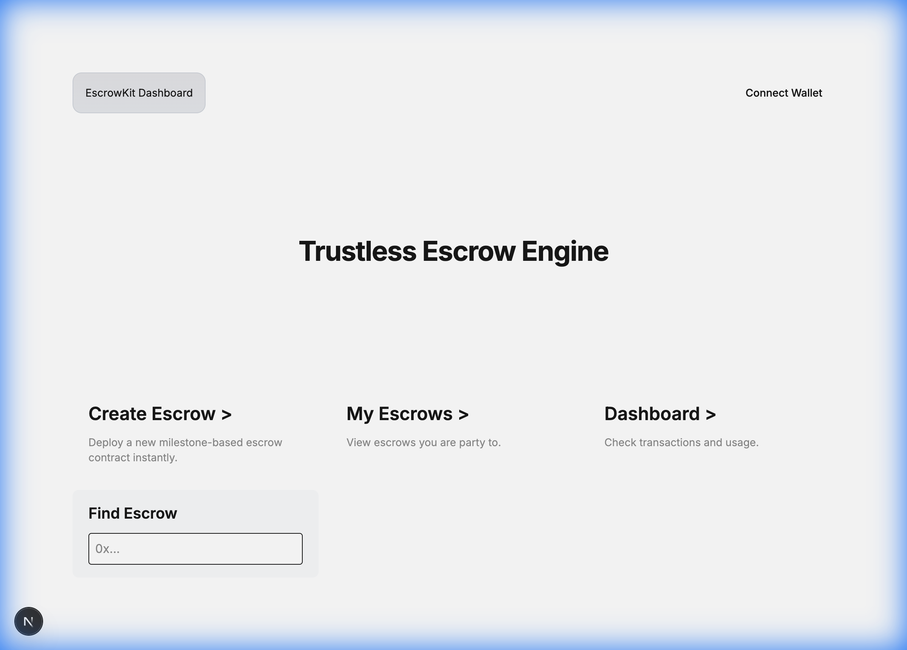
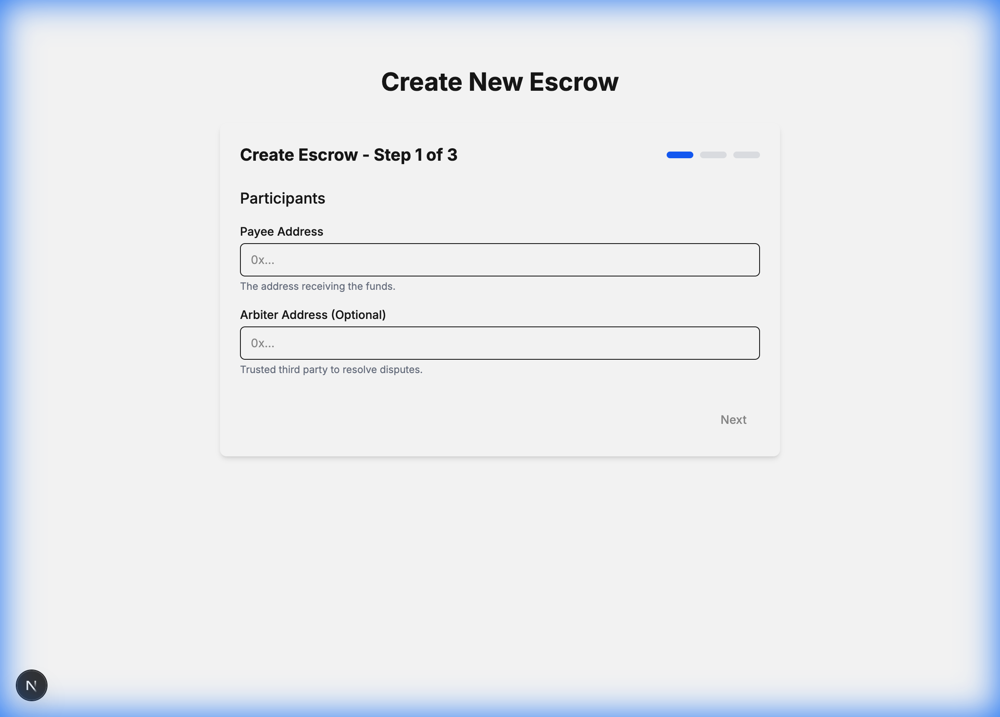
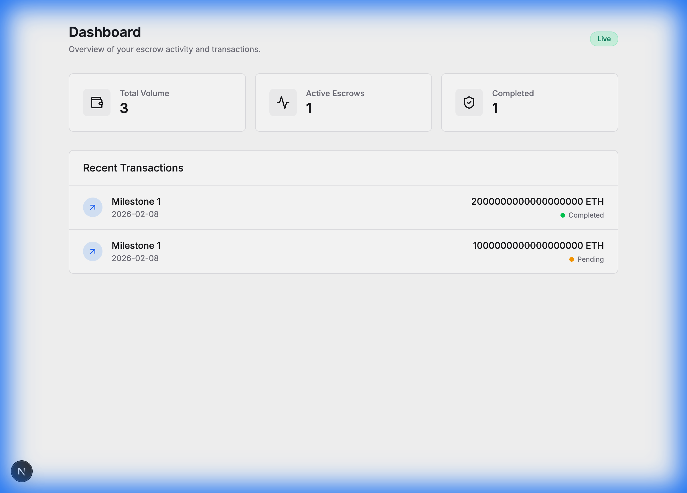

# EscrowKit: The Trustless Marketplace Engine

**Secure, Milestone-Based Payments for Any Platform.**

EscrowKit is a complete "Boxed Solution" for adding secure escrow transactions to your marketplace, freelance platform, or gig economy app. It ensures that service providers get paid when they deliver, and buyers only pay when work is approved.



---

## 🎯 What is EscrowKit?

For **Marketplace Owners**, it's a plug-and-play payment layer that builds trust between your users.
For **Developers**, it's a full-stack kit (Smart Contracts, API, Frontend, Indexer) used to deploy trustless payment flows in minutes.

### Key Features
*   **🛡️ Trustless Security**: Funds are locked in smart contracts, not held by you or a bank.
*   **📍 Milestone Payments**: Break large projects into smaller, fundable steps (e.g., "Design", "Frontend", "Backend").
*   **⚖️ Built-in Arbitration**: If a dispute arises, an appointed arbiter (you or a third party) can resolve it.
*   **🔍 Full Transparency**: Real-time status tracking for Payers and Payees.

---

## 📖 How It Works (User Guide)

EscrowKit is designed for three main roles: **Payer** (Buyer), **Payee** (Service Provider), and **Arbiter** (Mediator).

### 1. Create an Escrow
The **Payer** (or the Platform) starts by creating an escrow contract. They define:
*   **Who gets paid** (Payee Address).
*   **Who resolves disputes** (Arbiter Address).
*   **Milestones**: Descriptions, amounts, and deadlines for each step of the work.



### 2. Fund & Work
The **Payer** deposits funds into the secure contract. The **Payee** can see that funds are locked an safe.
*   **Payer View**: Can see pending milestones and add new ones (before funding).
*   **Payee View**: Can see "Funded" status and start working.



### 3. Submit & Approve
*   **Submission**: When a milestone is done, the **Payee** submits proof (e.g., a link or file hash).
*   **Approval**: The **Payer** reviews the work.
    *   ✅ **Approve**: Funds are instantly released to the Payee's wallet.
    *   ❌ **Dispute**: If work is unsatisfactory, either party can raise a dispute.

### 4. Dispute Resolution (If needed)
If a disagreement occurs, the **Arbiter** steps in. They review the evidence and can:
*   **Release Funds** to the Payee (if work was done).
*   **Refund Payer** (if work was not done).

---

## 🗺️ Roadmap & Open Tasks

We are building the standard for trustless payments. Here is where we need your help!

### 🟢 Beginner Friendly (Good First Issues)
- [ ] **UI Polish**: Improve the "Create Escrow" wizard responsiveness on mobile.
- [ ] **SDK**: Typescript wrapper for `createEscrow` function.
- [ ] **Docs**: Add a "How to Dispute" guide.

### � Intermediate
- [ ] **Evidence Upload**: Integrate IPFS (Pinata/Web3.Storage) for attaching files to milestones.
- [ ] **Notifications**: Email/Telegram alerts when a milestone is submitted or approved (using the Indexer).

### 🔴 Advanced
- [ ] **Arbitration Adapter**: Build a real adapter for [Kleros](https://kleros.io/) or [Reality.eth].
- [ ] **Cross-Chain**: Support for creating escrows on L2s (Optimism, Arb) with cross-chain signaling.
- [ ] **Graph Protocol**: Replace our custom indexer with a Subgraph.

---

## �🔌 Integration Guide (For Marketplaces)

If you run a platform (e.g., "Uber for Designers"), here is how you integrate EscrowKit:

### Step 1: Deploy the Factory
Deploy our **EscrowFactory** contract to your preferred blockchain (Ethereum, Polygon, Optimism, etc.). This single contract will spawn thousands of escrow agreements for your users.

### Step 2: Integrate the Frontend
Use our React Components (`CreateEscrowWizard`, `PayerView`, `PayeeView`) directly in your application.
*   **NPM Package**: `@escrowkit/sdk-ts` (Coming soon) helps you interact with the contracts easily.
*   **Customization**: You can style these components to match your brand (Tailwind CSS supported).

### Step 3: Listen for Events (The Indexer)
Run our **Indexer** service. It watches the blockchain 24/7.
*   When a user creates an escrow -> It saves it to your database.
*   When a payment is released -> It updates your platform's UI instantly.
*   **Data**: You get rich data (SQL/PostgreSQL) about every transaction without querying the slow blockchain.

---

## 🏗️ Technical Stack (For Developers)

*   **Smart Contracts**: Solidity (Foundry)
*   **Frontend**: Next.js, Wagmi, Viem, Tailwind CSS
*   **Backend**: NestJS, PostgreSQL, Prisma
*   **Indexer**: Node.js, Viem event listeners

### Quick Start (Local Dev)

1.  **Start Blockchain**: `anvil`
2.  **Deploy**: `forge script script/Deploy.s.sol ...`
3.  **Start DB**: `docker compose up -d`
4.  **Run All**: `pnpm dev`

See `packages/docs` for full API references.

---

## 🤝 How to Contribute

We love pull requests! Here's how to get started:

### 1. Fork & Clone
Fork this repository to your own GitHub account and clone it locally.
```bash
git clone https://github.com/YOUR_USERNAME/EscrowKit.git
cd EscrowKit
```

### 2. Set Up Environment
Follow the [Quick Start](#-quick-start) guide to get the local stack running (Anvil, Docker, pnpm).

### 3. Create a Branch
Create a branch for your feature or fix.
```bash
git checkout -b feature/amazing-new-feature
# or
git checkout -b fix/annoying-bug
```

### 4. Code & Test
Make your changes. Ensure you run tests!
- Contracts: `forge test`
- dApp: `pnpm build` (to check for type errors)

### 5. Commit & Push
Use [Conventional Commits](https://www.conventionalcommits.org/).
```bash
git commit -m "feat: add ipfs upload support"
git push origin feature/amazing-new-feature
```

### 6. Raise a Pull Request (PR)
- Go to the original [EscrowKit Repository](https://github.com/chetanya1998/EscrowKit).
- Click "New Pull Request".
- Select your branch.
- Fill out the PR template describe your changes clearly.
- Link to the issue you are solving (e.g., "Closes #123").

## 📄 License

MIT