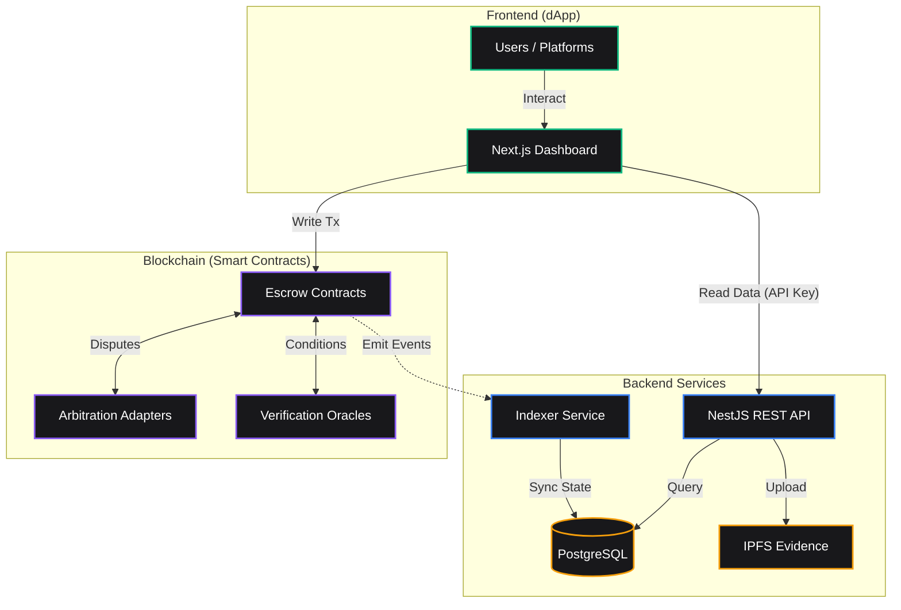

# EscrowKit: The Trustless Marketplace Engine 🛡️
> **Last Updated:** March 4, 2026  
> **Status:** Active Development — Core features implemented, deployed on Railway

---

## 1. Project Overview

**EscrowKit** is a full-stack, open-source "Boxed Solution" for adding trustless, milestone-based escrow payments to any marketplace, freelance platform, or gig economy application. It is designed around a **non-custodial** philosophy — funds are always held in smart contracts, never by the platform operator.

### Core Philosophy
- **Non-Custodial**: User funds live in smart contracts, not in any database or operator wallet.
- **Trustless**: All payment logic is governed by on-chain code; disputes are resolved by decentralized or pre-agreed arbiters.
- **Milestone-Based**: Payments are released incrementally as specific deliverables are completed and approved.
- **Pluggable**: Arbitration adapters, verification oracles, and token types are all swappable.

### Monorepo Structure
The project is organized as a **pnpm + Turborepo monorepo** with the following packages:

```
/
├── packages/
│   ├── contracts/     # Solidity smart contracts (Foundry)
│   ├── indexer/       # Blockchain event indexer (TypeScript, Viem, Prisma)
│   ├── api/           # REST API backend (NestJS)
│   ├── dapp/          # Frontend dashboard (Next.js App Router)
│   ├── sdk-ts/        # TypeScript SDK for developers
│   └── docs/          # Docusaurus documentation site
├── .github/workflows/ # CI/CD (GitHub Actions)
├── docker-compose.yml # Local PostgreSQL + Redis
├── nixpacks.toml      # Railway deployment config
└── turbo.json         # Turborepo pipeline config
```

---

## 📖 For Non-Technical Users: How to Get Started

If you are looking to use EscrowKit to secure a transaction (like hiring a freelancer, buying a high-value item, or renting property), you don't need any coding or smart contract experience.

### 1. Connect Your Wallet
Visit the EscrowKit web dashboard and connect your Web3 wallet (like MetaMask, Coinbase Wallet, or WalletConnect).

### 2. Access the Custom Escrow Builder (Crucial Feature)
Click **"Create Escrow"**. This launches our highly customizable, no-code **Custom Escrow Builder**. This 3-step wizard allows you to define the exact rules of your escrow without writing any code:

*   **Step 0 — Template Selection:** Start by picking a base template. 
    *   *Freelance & Services Template:* Use this when paying someone for milestone-based work.
    *   *Rental Deposit Template:* Use this to hold a security deposit for an item or property rental.
*   **Step 1 — Configuration:** Add customized rules. Enter the Counterparty's wallet address. For milestone escrows, you define how many milestones, their values, and the deadlines. For rentals, you define the total deposit and the dispute window. You also select an **Arbiter** (a trusted third party or a decentralized court like Kleros) who resolves disputes.
*   **Step 2 — Review & Deploy:** Review the mathematical breakdown of your custom escrow. Follow the on-screen prompts to automatically deploy your bespoke smart contract to the blockchain.

### 3. Deploy & Fund
Once deployed, deposit the funds into the secure smart contract. The funds are locked and can only be released when both parties agree or an Arbiter steps in.

### 4. Release Payment
Once the work is done (or the rental period ends securely), click "Approve" to release the funds directly to the recipient. If something goes wrong, click "Dispute" to call the Arbiter.

---

## 💼 For Founders: How to Integrate EscrowKit into Your Project

If you are building a marketplace, an Upwork clone, a DAO platform, or a P2P rental site, EscrowKit acts as your backend engine for payments. You never need to hold licenses for money transmission because the smart contracts natively hold the funds (**Non-Custodial**).

### Integration Pathways:

1.  **The TypeScript SDK (Direct Web3 Integration):** 
    If your app has a custom Web3 frontend (React/Next.js/Vue), use our `@escrowkit/sdk-ts`. It allows your frontend to seamlessly build and execute escrow transactions directly through your user's connected wallet.
2.  **The REST API & Webhooks (Web2.5 Backend Integration):** 
    If you run a traditional Web2 backend (Node.js, Django, Ruby), use the EscrowKit REST API to track transactions off-chain. Register a secure **Webhook** to listen for `EscrowCreated` or `MilestoneReleased` events, ensuring your database stays in perfectly synced real-time with the blockchain.
3.  **White-Label / Hosted Interface:** 
    Send your users directly to the EscrowKit Dashboard to handle the payment flow, similar to a Stripe Checkout experience. Your platform passes the parameters, and EscrowKit handles the blockchain complexity.

---

## 🏗️ System Architecture



## 2. Smart Contracts (`packages/contracts`)

**Tech Stack:** Solidity `^0.8.20`, Foundry, OpenZeppelin

### 2.1 `EscrowFactory.sol`
The central registry and factory contract. Uses the **EIP-1167 Minimal Proxy (Clone)** pattern to deploy cheap escrow instances.

**Key Functions:**
| Function | Description |
|---|---|
| `createEscrow(payee, arbiter, adapter, detailsHash, oracle, config)` | Deploys a new `MilestoneEscrow` clone. Caller becomes the payer. |
| `createRentalEscrow(payee, arbiter, adapter, token, depositAmount, config)` | Deploys a new `RentalEscrow` clone for security deposit use cases. |
| `getEscrowCount()` | Returns total number of escrows created. |
| `getEscrowAt(index)` | Returns the address of an escrow by index. |

**Events Emitted:** `EscrowCreated(address escrowAddress, address payer, address payee, address arbiter)`

---

### 2.2 `MilestoneEscrow.sol` *(Core Contract)*
The primary escrow contract for freelance/services use cases. Each instance is a clone initialized via `initialize()`.

**State Variables:**
- `payer`, `payee`, `arbiter` — the three parties
- `arbitrationAdapter` — pluggable dispute resolution contract
- `token` — ERC-20 token address, or `address(0)` for native ETH
- `verificationOracle` — optional on-chain condition verifier
- `milestones[]` — array of `Milestone` structs
- `totalFunded`, `totalReleased`, `totalRefunded` — solvency tracking

**Milestone Lifecycle States:**
```
PENDING → SUBMITTED → APPROVED → RELEASED
                  ↘ DISPUTED ↗
PENDING → REFUNDED (deadline passed)
```

**Key Functions:**
| Function | Caller | Description |
|---|---|---|
| `addMilestones(amounts, descriptions, deadlines, conditionHashes)` | Payer | Adds milestones before funding. Requires `totalFunded == 0`. |
| `updateMilestone(id, amount, desc, deadline)` | Payer | Edits a pending milestone before funding. |
| `fund()` | Payer | Funds all pending milestones at once (ETH or ERC-20). |
| `submitDeliverable(milestoneId, deliverableHash)` | Payee | Marks work as done, stores a bytes32 hash of the deliverable. |
| `approveMilestone(milestoneId)` | Payer | Approves and triggers fund release. Checks oracle if conditionHash is set. |
| `releaseMilestone(milestoneId)` | Internal | Transfers funds to payee (ETH or ERC-20). |
| `refundMilestone(milestoneId)` | Payer | Refunds a milestone after its deadline has passed. |
| `openDispute(milestoneId)` | Payer or Payee | Opens a dispute, optionally routing to the arbitration adapter. |
| `resolveDispute(milestoneId, resolution)` | Arbiter | Manually resolves a dispute (RELEASED or REFUNDED). |
| `rule(disputeId, ruling)` | Arbitration Adapter | Called by the adapter after decentralized arbitration. Ruling 1 = Release, 2 = Refund. |

**Security Features:**
- `ReentrancyGuard` on all fund-moving functions
- `SafeERC20` for token transfers
- Solvency invariant: `balance >= totalFunded - totalReleased - totalRefunded`
- Core terms (arbiter, fee) are immutable after initialization

---

### 2.3 `RentalEscrow.sol`
A specialized escrow for **security deposit** use cases (e.g., landlord/tenant). Handles a single deposit amount with a claim-and-dispute flow.

**Rental Lifecycle States:**
```
AWAITING_DEPOSIT → ACTIVE → CLAIM_PENDING → ENDED
                                        ↘ DISPUTED → ENDED
```

**Key Functions:**
| Function | Caller | Description |
|---|---|---|
| `deposit()` | Payer (Tenant) | Deposits the full security deposit amount. |
| `claim(amount, reason)` | Payee (Landlord) | Claims a portion of the deposit with a reason string. Starts a claim window. |
| `acceptClaim()` | Payer or Payee (after deadline) | Accepts the claim, distributing funds accordingly. |
| `disputeClaim()` | Payer | Disputes the landlord's claim, routing to arbitration. |
| `resolveDispute(payeeAmount)` | Arbiter | Manually resolves the dispute with a custom split. |
| `rule(disputeId, ruling)` | Arbitration Adapter | Kleros/adapter callback. Ruling 1 = Landlord wins, 2 = Tenant wins. |

---

### 2.4 `KlerosAdapter.sol`
Integrates with the **Kleros** decentralized arbitration protocol (ERC-792 standard).

- Implements `IArbitrationAdapter` and `IArbitrable`
- Creates disputes on Kleros with 2 choices (Release to Payee / Refund to Payer)
- Implements the **ERC-1497 Evidence Standard** (`MetaEvidence`, `Evidence` events)
- Refunds excess arbitration fees to the caller
- Stores a mapping of Kleros `disputeId` → `(escrowAddress, milestoneId)`
- `rule()` is called by Kleros and routes the ruling back to the escrow contract

---

### 2.5 `SimpleArbiterAdapter.sol`
A lightweight, centralized arbitration adapter for use cases where a trusted human or DAO acts as arbiter.

- Configurable `disputeCost` (fee to open a dispute)
- Designated `arbiter` address that calls `resolveDispute()`
- Admin functions: `setArbiter()`, `setDisputeCost()`, `withdrawFees()`
- Suitable for MVP or trusted-party setups without decentralized arbitration

---

### 2.6 `VerificationOracle.sol`
An on-chain registry for trusted verification results. Enables **automated milestone approval** based on off-chain conditions (e.g., a GitHub PR being merged).

- Maintains a mapping of `conditionHash → bool isVerified`
- Authorized verifiers (oracles/bots) call `attest(conditionHash, status)` to record results
- `MilestoneEscrow.approveMilestone()` checks this oracle if a `conditionHash` is set on the milestone
- Designed to be replaceable with an **EAS (Ethereum Attestation Service)** interface in production
- Admin can add/remove authorized verifiers

---

### 2.7 `ConditionEngine.sol`
A pure library contract with utility functions for condition checking (e.g., `isDeadlinePassed(deadline)`). Used internally by `MilestoneEscrow`.

---

### 2.8 `MockAdapter.sol`
A test-only arbitration adapter that immediately resolves disputes for use in Foundry tests.

---

### Contract Interfaces (`packages/contracts/src/interfaces/`)
- `IMilestoneEscrow.sol` — defines `Milestone` struct, `MilestoneStatus` enum, and all function signatures
- `IRentalEscrow.sol` — defines `RentalConfig`, `RentalStatus` enum
- `IEscrowFactory.sol` — factory interface
- `IArbitrationAdapter.sol` — adapter interface (`createDispute`, `getDisputeCost`, `getArbiter`)
- `IArbitrator.sol` — Kleros arbitrator interface (ERC-792)
- `IArbitrable.sol` — Kleros arbitrable interface
- `IArbitrableEscrow.sol` — combined interface for escrows that accept rulings

---

## 3. Indexer Service (`packages/indexer`)

**Tech Stack:** TypeScript, Viem, Prisma ORM, PostgreSQL, `@prisma/adapter-pg`

The indexer is a long-running Node.js process that listens to blockchain events and syncs state to a PostgreSQL database, making it queryable by the API.

### Chain Support
- **Local Dev:** Anvil (Foundry local chain, Chain ID 31337)
- **Production:** Base Sepolia (Chain ID 84532)
- Configurable via `CHAIN_ID` and `RPC_URL` environment variables

### Events Indexed
| Event | Source Contract | Action |
|---|---|---|
| `EscrowCreated` | `EscrowFactory` | Creates `Escrow` record in DB, starts watching the new instance |
| `MilestoneAdded` | `MilestoneEscrow` | Fetches full milestone data from chain, creates `Milestone` record |
| `MilestoneSubmitted` | `MilestoneEscrow` | Updates milestone status to `SUBMITTED`, stores `deliverableHash` |
| `MilestoneApproved` | `MilestoneEscrow` | Updates milestone status to `APPROVED` |
| `MilestoneReleased` | `MilestoneEscrow` | Updates milestone status to `RELEASED` |
| `MilestoneRefunded` | `MilestoneEscrow` | Updates milestone status to `REFUNDED` |
| `MilestoneFunded` | `MilestoneEscrow` | Logs the funding event |
| `MilestoneUpdated` | `MilestoneEscrow` | Updates amount, description, and deadline in DB |
| `DisputeOpened` | `MilestoneEscrow` | Updates milestone to `DISPUTED`, creates `Dispute` record |
| `VerificationAttested` | `VerificationOracle` | Updates all milestones with matching `conditionHash` to `isVerified: true` |

### Webhook Triggering
The indexer includes a `triggerWebhooks()` function that:
- Queries active webhooks from the DB that are subscribed to a given event
- Constructs a signed payload with `X-EscrowKit-Signature` (HMAC-SHA256)
- Sends `POST` requests to all registered webhook URLs with event data and timestamp

---

## 4. REST API (`packages/api`)

**Tech Stack:** NestJS, Passport.js, JWT, bcryptjs, Prisma, Swagger

**Base URL:** `http://localhost:3001` (local) / Railway deployment URL (production)

### 4.1 Authentication System (`/auth`)
A full authentication system supporting two providers:

**Email/Password Auth:**
- `POST /auth/signup` — Register with email, password, optional username. Passwords hashed with bcrypt (12 rounds).
- `POST /auth/login` — Login, returns JWT access token.

**Google OAuth:**
- `GET /auth/google` — Initiates Google OAuth flow.
- `GET /auth/google/callback` — Handles OAuth callback, creates or links user account, returns JWT.

**Profile:**
- `GET /auth/profile` — Returns authenticated user's profile (requires JWT Bearer token).

**JWT Strategy:** Passport JWT strategy validates tokens on protected routes.

---

### 4.2 Escrow Endpoints (`/api/v1/escrows`)
Secured via API Key header (`x-api-key`).

| Endpoint | Method | Description |
|---|---|---|
| `/api/v1/escrows` | GET | List all escrows where the API key owner is payer or payee |
| `/api/v1/escrows/:address` | GET | Get full details of a specific escrow including milestones, disputes, and event history |

---

### 4.3 Transaction Helper Endpoints (`/api/v1/transactions`)
Generates encoded calldata for smart contract interactions — useful for backend-driven transaction construction.

| Endpoint | Method | Description |
|---|---|---|
| `/api/v1/transactions/deploy` | POST | Generate calldata to deploy a new escrow via the Factory |
| `/api/v1/transactions/release` | POST | Generate calldata to release a specific milestone |

---

### 4.4 Webhook Management (`/api/v1/webhooks`)
| Endpoint | Method | Description |
|---|---|---|
| `/api/v1/webhooks` | POST | Register a new webhook URL with event subscriptions and optional signing secret |
| `/api/v1/webhooks` | GET | List all registered webhooks for the authenticated user |

---

### 4.5 Evidence Storage (`/evidence`)
Decentralized-ready file storage for dispute evidence and milestone deliverables.

| Endpoint | Method | Description |
|---|---|---|
| `/evidence/upload` | POST | Upload a file (PDF, image, etc.) — returns an IPFS-compatible hash and URL |
| `/evidence/:hash` | GET | Download a file by its hash |

---

### 4.6 Milestone Drafts (`/api/v1/drafts`)
Collaborative drafting of milestones before on-chain deployment.

| Endpoint | Method | Description |
|---|---|---|
| `/api/v1/drafts` | POST | Create a draft milestone with title, description, amount, deadline |
| `/api/v1/drafts/:escrowAddress` | GET | Retrieve all drafts for a given escrow address |

---

### 4.7 Dispute Endpoints (`/api/v1/disputes`)
| Endpoint | Method | Description |
|---|---|---|
| `/api/v1/disputes/evidence` | POST | Generate `submitEvidence` calldata for the arbitration adapter |
| `/api/v1/disputes/webhook/ruling` | POST | Webhook endpoint for arbitration services to push rulings |

---

### 4.8 Public API Module (`/api/v1/public`)
A separate module for third-party platform integrations, secured via API keys.

---

### 4.9 Pulsar Module
Internal messaging/event bus module (Apache Pulsar integration) for internal service communication.

---

## 5. dApp Dashboard (`packages/dapp`)

**Tech Stack:** Next.js 14 (App Router), Wagmi v2, Viem, Shadcn UI, Tailwind CSS, Lucide Icons

### 5.1 Wallet Connection
- Configured via `wagmi.ts` using `WagmiProvider`
- Supports multiple connectors (MetaMask, WalletConnect, etc.)
- Chain configured for local Anvil and Base Sepolia

### 5.2 Create Escrow Wizard (`CreateEscrowWizard.tsx`)
A **3-step guided wizard** for deploying new escrow contracts:

**Step 0 — Template Selection:**
- **Freelance & Services** — Milestone-based payments for work completion
- **Rental Deposit** — Security deposit hold for landlord/tenant scenarios

**Step 1 — Configuration:**
- Project/property title
- Payee wallet address (or ENS)
- Optional arbiter address
- For Rental: deposit amount (ETH) and claim window (seconds)
- For Freelance: arbitration fee, dispute window, automatic release time

**Step 2 — Review & Deploy:**
- Summary of all configuration
- Calls `EscrowFactory.createEscrow()` or `createRentalEscrow()` via Wagmi's `useWriteContract`
- Shows transaction hash and loading states
- On success, redirects to `/dashboard/escrows`
- Note: Milestones are added **after** deployment for the freelance template

### 5.3 Dashboard Pages
Located in `packages/dapp/src/components/dashboard/` and `packages/dapp/src/components/escrow/`:

- **Escrow List View** — Shows all escrows for the connected wallet
- **Escrow Detail View** — Full escrow page with milestone management, funding, dispute actions
- **Settings** — API key management and developer settings

### 5.4 UI Component Library
Built with **Shadcn UI** components in `packages/dapp/src/components/ui/`:
- `Button`, `Input`, `Card`, `Badge`, `Separator`, `Dialog`, etc.
- Dark theme with `neutral` color palette and `emerald` accents

### 5.5 Hooks (`packages/dapp/src/hooks/`)
Custom React hooks for contract interactions (4 hooks total).

### 5.6 ABI & Constants (`packages/dapp/src/lib/`)
- Pre-compiled ABI JSON files for all contracts: `EscrowFactory.json`, `MilestoneEscrow.json`, `RentalEscrow.json`, `SimpleArbiterAdapter.json`, `VerificationOracle.json`
- `constants.ts` — `FACTORY_ADDRESS`, `FACTORY_ABI`, `VERIFICATION_ORACLE_ADDRESS`
- `utils.ts` — Utility helpers (e.g., `cn()` for class merging)
- `mock-data.ts` — Mock data for UI development

---

## 6. Detailed SDK Implementation (`packages/sdk-ts`)

**Tech Stack:** TypeScript, Viem, tsup (bundler)

The SDK provides a heavily typed, developer-friendly `EscrowKitClient` class for integrating EscrowKit into any TypeScript/JavaScript application. It abstracts away ABI encoding, raw contract interactions, and exact gas estimations.

### Integration & Installation
Integrate the SDK into your project using your preferred package manager (requires `viem` as a peer dependency):
```bash
npm install @escrowkit/sdk-ts viem
```

### `EscrowKitClient` Initialization
To start using the SDK, configure it with a Viem transport and your chain parameters:

```typescript
import { EscrowKitClient } from '@escrowkit/sdk-ts';
import { createWalletClient, custom, http } from 'viem';
import { baseSepolia } from 'viem/chains';

const walletClient = createWalletClient({
    chain: baseSepolia,
    transport: custom(window.ethereum)
});

const client = new EscrowKitClient({
    chain: baseSepolia,
    transport: http(),
    factoryAddress: '0xYourFactoryAddress',
    walletClient: walletClient, // Required for write operations
});
```

### Key Capabilities & Methods:
The SDK handles all complex on-chain interactions automatically.

| Method | Description | Technical Implementation |
|---|---|---|
| `createEscrow(config)` | Deploys a new escrow instance via the `EscrowFactory`. | Encodes parameters, submits cloning transaction, and returns the deterministic new address. |
| `addMilestones(address, milestones)` | Adds milestones to a pending escrow. | Batches arrays of amounts, descriptions, deadlines, and verifies condition hashes natively. |
| `fund(address, amount)` | Funds pending milestones. | Handles native ETH `msg.value` or automatically manages ERC-20 `approve()` flows before funding. |
| `approveMilestone(address, id)` | Releases funds for a completed milestone. | Triggers the `releaseMilestone` logic on the smart contract safely. |
| `openDispute(address, id)` | Initiates the arbitration process. | Pays the `disputeFee` specifically to the configured `ArbitrationAdapter`. |

**Exports:** `EscrowKitClient`, `FACTORY_ABI`, `ESCROW_ABI`, and comprehensively documented types from `types.ts`.

**Workflow Recipes (`recipes.ts`):** We provide pre-built asynchronous workflow recipes for common UI patterns (e.g., deploying an escrow, adding 3 milestones, and funding it all in fully batched sequential transactions).

---

## 7. Database Schema

Managed by **Prisma ORM** with **PostgreSQL** as the database.

### Core Models

**`User`**
- `id`, `email`, `username`, `passwordHash`, `googleId`, `avatar`, `bio`, `address`, `authProvider`
- Supports both `local` (email/password) and `google` auth providers

**`Escrow`**
- `address` (PK — contract address), `payer`, `payee`, `arbiter`, `factoryAddress`
- Relations: `milestones[]`, `events[]`, `disputes[]`

**`Milestone`**
- `escrowAddress` + `index` (composite PK)
- `amount`, `description`, `deadline`, `status`, `deliverableHash`, `conditionHash`, `isVerified`, `disputeId`

**`Event`**
- `id`, `escrowAddress`, `eventName`, `blockNumber`, `transactionHash`, `args` (JSON)
- Full audit trail of all on-chain events

**`Dispute`**
- `id`, `escrowAddress`, `milestoneIndex`, `disputeIdOnChain`, `status`

**`Webhook`**
- `id`, `url`, `events[]`, `secret`, `isActive`

---

## 8. CI/CD & DevOps

### GitHub Actions (`.github/workflows/ci.yml`)
Triggered on push to `main` and all pull requests.

**Pipeline Steps:**
1. Checkout code (with depth 2 for Turborepo change detection)
2. Install Foundry (nightly) for contract compilation and testing
3. Setup Node.js 20
4. Install pnpm 10
5. Cache pnpm store (keyed by `pnpm-lock.yaml` hash)
6. Install all dependencies (`pnpm install`)
7. Generate Prisma Client for both `indexer` and `api` packages
8. Build all packages (`pnpm build` via Turborepo)
9. Run Foundry contract tests (`forge test`)

### Railway Deployment
- Configured via `nixpacks.toml` for Railway's Nixpacks build system
- Monorepo-aware configuration to build and serve the dApp and API
- Environment variables managed in Railway dashboard

---

## 👨‍💻 For Developers & Open Source Contributors: How to Start

We highly encourage open-source contributions! EscrowKit is broken down into modular packages, meaning you can contribute purely to Smart Contracts, the Frontend, or the Backend APIs.

### Prerequisites to Contribute
*   **Node.js v20+** & **pnpm 10** (for running the web apps and indexer)
*   **Foundry** (for compiling and testing smart contracts locally)
*   **Docker** (for spinning up the local PostgreSQL and Redis DBs)

### Full Local Development Setup
To boot up the entire Trustless Marketplace Engine locally, follow these steps:

```bash
# 1. Start the local Ethereum blockchain
anvil

# 2. Build and Deploy the Smart Contracts locally
cd packages/contracts
forge script script/Deploy.s.sol --broadcast --rpc-url http://127.0.0.1:8545

# 3. Start PostgreSQL (Database) via Docker
docker-compose up -d

# 4. Run the REST API Backend
cd packages/api 
pnpm install
pnpm dev

# 5. Run the Blockchain Indexer
cd packages/indexer 
pnpm install
pnpm dev

# 6. Run the Next.js Dashboard (dApp)
cd packages/dapp 
pnpm install
pnpm dev
# → Visit http://localhost:3000
```

### Contributing Workflow
1. Fork the repository and create your feature branch (`git checkout -b feature/amazing-feature`).
2. Adhere to the existing ESLint configurations and Run `pnpm format`.
3. Ensure smart contract changes pass Foundry tests (`forge test`).
4. Commit your changes (`git commit -m "feat: add amazing feature"`).
5. Push to the branch and open a Pull Request.

---

## 9. Documentation (`packages/docs`)

Built with **Docusaurus**. Contains documentation for:
- Smart contracts (function references, security model)
- Indexer setup and configuration
- API reference
- dApp usage guide
- SDK integration guide
- Contributor guidelines

---

## 10. Current Status & What's Been Built

### ✅ Completed Features

**Smart Contracts:**
- [x] `EscrowFactory` with EIP-1167 clone pattern for both Milestone and Rental escrows
- [x] `MilestoneEscrow` — full lifecycle (add, fund, submit, approve, release, refund, dispute)
- [x] `RentalEscrow` — deposit, claim, accept, dispute, resolve flow
- [x] `KlerosAdapter` — full ERC-792 + ERC-1497 integration
- [x] `SimpleArbiterAdapter` — centralized/trusted arbiter adapter
- [x] `VerificationOracle` — on-chain condition verification registry
- [x] `ConditionEngine` — deadline checking library
- [x] ETH and ERC-20 token support in both escrow types
- [x] Reentrancy protection on all fund-moving functions

**Indexer:**
- [x] Real-time event watching for all escrow lifecycle events
- [x] PostgreSQL persistence via Prisma
- [x] Multi-chain support (Anvil local + Base Sepolia)
- [x] Webhook triggering with HMAC-SHA256 signatures
- [x] VerificationOracle event indexing

**API (NestJS):**
- [x] Email/password authentication (bcrypt, JWT)
- [x] Google OAuth 2.0 authentication with account linking
- [x] API key-secured public endpoints
- [x] Escrow list and detail endpoints
- [x] Transaction calldata helper endpoints
- [x] Webhook registration and management
- [x] Evidence file upload/download
- [x] Milestone draft management
- [x] Dispute evidence calldata generation
- [x] Swagger API documentation

**dApp (Next.js):**
- [x] Wagmi wallet connection
- [x] 3-step Create Escrow Wizard (Freelance + Rental templates)
- [x] Dashboard layout with Shadcn UI dark theme
- [x] Escrow list and detail views
- [x] Settings/API key management UI
- [x] Custom logo and branding

**SDK:**
- [x] `EscrowKitClient` class with `createEscrow`, `addMilestones`, `fund`
- [x] TypeScript types and ABI exports
- [x] Recipe patterns for common workflows

**DevOps:**
- [x] GitHub Actions CI pipeline (build + Foundry tests)
- [x] Railway deployment configuration (nixpacks.toml)
- [x] Docker Compose for local PostgreSQL
- [x] Turborepo build pipeline with caching
- [x] Docusaurus documentation site

---

## 11. Key Design Decisions

1. **Clone Pattern for Contracts:** Using EIP-1167 minimal proxies means each escrow instance costs ~10x less gas to deploy than a full contract deployment.

2. **Pluggable Arbitration:** The `IArbitrationAdapter` interface allows swapping between Kleros (decentralized), SimpleArbiter (trusted party), or any custom adapter without changing the core escrow logic.

3. **Verification Oracle:** The `VerificationOracle` enables automated milestone releases triggered by off-chain events (CI/CD pipelines, API calls, etc.) without requiring manual payer approval.

4. **Dual Auth Providers:** Supporting both email/password and Google OAuth with automatic account linking provides flexibility while maintaining a single user identity.

5. **Indexer + API Separation:** The indexer and API are separate services. The indexer writes to the DB; the API reads from it. This separation allows independent scaling and prevents the API from being blocked by slow blockchain operations.

6. **Webhook Signing:** All webhook payloads are signed with HMAC-SHA256, allowing receiving servers to verify authenticity — a standard pattern used by Stripe, GitHub, etc.

---

## 12. Known Limitations & Future Work

- **SDK is MVP:** The `EscrowKitClient` only covers `createEscrow`, `addMilestones`, and `fund`. Methods for `submitDeliverable`, `approveMilestone`, `openDispute` are noted as TODO.
- **Indexer historical sync:** The indexer uses `watchContractEvent` (real-time only). It does not backfill historical events from before it started running.
- **Rental Escrow in dApp:** The `RentalEscrow` contract is fully implemented but the dApp's detail view may not yet expose all rental-specific actions (claim, acceptClaim, disputeClaim).
- **ERC-20 token support in dApp:** The wizard defaults to ETH (`address(0)`). Token-based escrows require additional UI for token approval flows.
- **KlerosAdapter bug:** In `rule()`, there is a potential bug: `IArbitrableEscrow(d.escrow).rule(d.active ? _disputeID : 0, _ruling)` — `d.active` is set to `false` before this line, so it always passes `0` as the disputeId.
- **No historical event backfill** in the indexer — only real-time events from when the indexer starts.

---

## 13. Multi-Layer Security Enhancements 🛡️

To protect the non-custodial engine, EscrowKit employs a fully integrated 3-layer security system guarding against unverified payloads, smart contract vulnerabilities, and frontend exploits.

### Layer 1: Smart Contracts (The Vault)
- **Pausable Circuit Breakers**: `EscrowFactory` and `MilestoneEscrow` utilize OpenZeppelin's `Pausable`. The system can be frozen by the `PAUSER_ROLE` in the event of an impending attack, blocking all internal distributions while protecting locked user deposits.
- **Granular Access Control**: Administrative tasks utilize OpenZeppelin `AccessControl` rather than basic `Ownable`. Roles (`DEFAULT_ADMIN_ROLE`, `PAUSER_ROLE`) are explicitly separated.
- **BPS Fee Ceilings**: Malicious or accidental logic faults altering dynamic Arbiter Fees or Delay Penalties are natively blocked by strict integer upper bounds built directly into contract `initialize()` loops (\<= 1000 BPS / 10%).

### Layer 2: Backend API (The Bridge)
- **DDoS Mitigation (Throttling)**: Endpoints natively use `@nestjs/throttler` rejecting traffic scaling beyond 100 reqs/minute per user. 
- **Header Hardening**: `helmet` is equipped locally across the NestJS REST framework, dropping over 14+ standardized exploitive headers (like No-Sniff/HSTS).
- **Strict DTO Truncation**: Inputs entering the backend are scrubbed tightly. Using `class-validator` passing global pipes with `whitelist` and `forbidNonWhitelisted`, raw injected parameters not part of definitions are deleted immediately.
- **CORS Allowlist**: API blocks open scraping architecture out of the box by isolating acceptable REST requests purely up to explicitly allowed frontend IPs and subdomains.

### Layer 3: Next.js dApp (The Surface)
- **Content Security Policy**: `layout.tsx` embeds native CSP configurations locking external connections (XSS) and disallowing unverified `script-src` / `frame-ancestors` from performing browser clickjacking.
- **Isomorphic DOM Sanitization**: Rendering arbitrary text strings pulled from the blockchain (like Milestone descriptions) passes natively through `isomorphic-dompurify`. Any underlying `<script>` insertions submitted historically on-chain are wiped out before they pass to the DOM tree.
