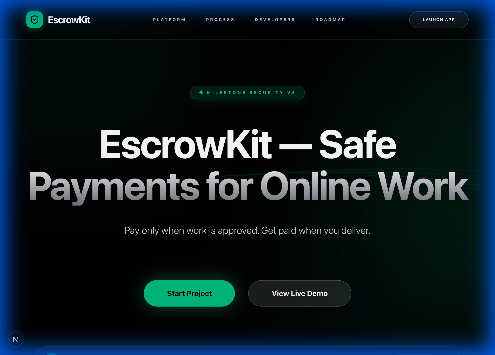
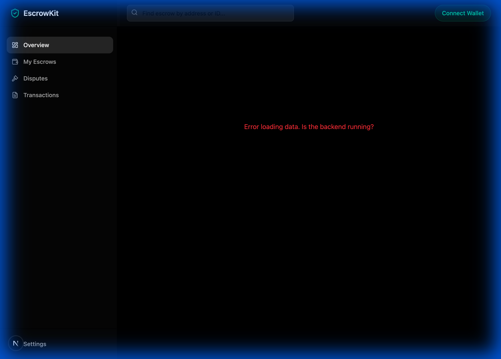
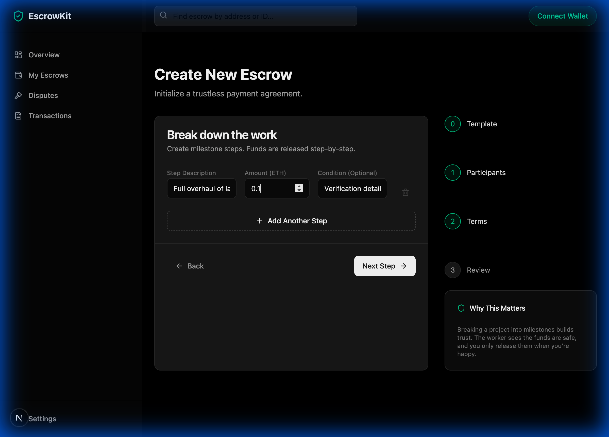
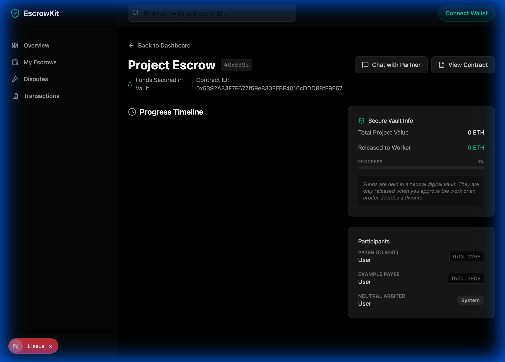

# EscrowKit: The Trustless Marketplace Engine 🛡️

**Secure, Milestone-Based Payments for Any Platform.**

EscrowKit is a complete "Boxed Solution" for adding secure escrow transactions to your marketplace, freelance platform, or gig economy app. It handles the complexity of smart contracts, disputes, and payment releases so you don't have to.

## 🎥 Agent Demo


---

## 🌟 Key Features

*   **⚡ Smart Escrow Contracts**: Audited, gas-optimized contracts for milestone payments.
*   **⚖️ Built-in Arbitration**: Integrated dispute resolution (Kleros, Reality.eth, or custom).
*   **🖥️ Admin Dashboard**: Manage transactions, disputes, and API keys in one place.
*   **🔌 Easy Integration**: REST API and SDK for deep integration into your existing platform.
*   **🔍 Indexer Service**: Real-time data syncing from blockchain to a queryable database.

---

## 🚀 Dashboard Flow

EscrowKit provides a ready-to-use user interface for you and your users.

### 1. Home Page


### 2. Dashboard Overview


### 3. Create Escrow
Located in the sidebar, the **Create Escrow** page allows you to initialize a new transaction.

- **Inputs**: Payer Address, Payee Address, Milestones (Description, Amount).
- **Result**: Deploys a new smart contract on the blockchain.

### 4. Escrow Details & Management
Once created, users are directed to a dedicated Escrow Page.

- **Payer View**: Fund escrow, Approve milestones (release funds), Raise dispute.
- **Payee View**: Submit work, Request release.
- **State**: The UI updates in real-time as the contract state changes (Funded -> Active -> Completed).

### 3. Developer Settings
Generate API Keys to access the EscrowKit API for your own backend integration.

---

## 📡 API Reference

EscrowKit exposes a REST API for platforms to query data programmatically.

**Base URL**: `http://localhost:3001/api/v1`

### Authentication
Include your API Key in the header:
`x-api-key: YOUR_API_KEY`

### Endpoints

#### `GET /escrows`
Retrieve a list of escrows associated with your account.
*   **Response**: `[ { "address": "0x...", "status": "FUNDED", "balance": "1.5" }, ... ]`

#### `GET /escrows/:address`
Get detailed information about a specific escrow.
*   **Params**: `address` (Ethereum address of the escrow contract)
*   **Response**:
    ```json
    {
      "address": "0x5392...",
      "payer": "0x7099...",
      "payee": "0x3C44...",
      "milestones": [
        { "id": 1, "description": "Design Phase", "amount": "0.5", "status": "PENDING" }
      ],
      "events": [...]
    }
    ```

#### `POST /disputes/evidence`
Submit meta-evidence for a dispute resolution process.
*   **Body**: `{ "disputeId": 123, "evidence": "ipfs://..." }`

---

## 🏗️ Architecture

EscrowKit allows you to remain **Non-Custodial**. You never touch the user's funds.


For a deep dive into the system design, see [Architecture.md](./Architecture.md).

---

## 🛠️ Getting Started

### Prerequisites
*   Node.js v18+
*   pnpm / yarn
*   Foundry (for local blockchain)
*   Docker (for Database)

### 1. Start Local Blockchain
```bash
anvil
```

### 2. Deploy Contracts
```bash
cd packages/contracts
forge script script/Deploy.s.sol --broadcast --rpc-url http://127.0.0.1:8545
```

### 3. Run Backend (API & Indexer)
```bash
cd packages/api
pnpm dev
# In another terminal
cd packages/indexer
pnpm dev
```

### 4. Run Dashboard (dApp)
```bash
cd packages/dapp
pnpm dev
```
Visit `http://localhost:3000` to see your running instance!

---

## 🧪 Testing

We include a full suite of tests.

**Unit Tests**:
```bash
cd packages/dapp
npx jest
```

**E2E / Script Verification**:
Create a test escrow on your local chain:
```bash
npx ts-node --compiler-options '{"resolveJsonModule":true}' create-escrow.ts
```

---

## 🤝 Contributing
1.  Fork the repo
2.  Create a feature branch
3.  Submit a Pull Request

---

**Built with ❤️ for a Trustless Future.**